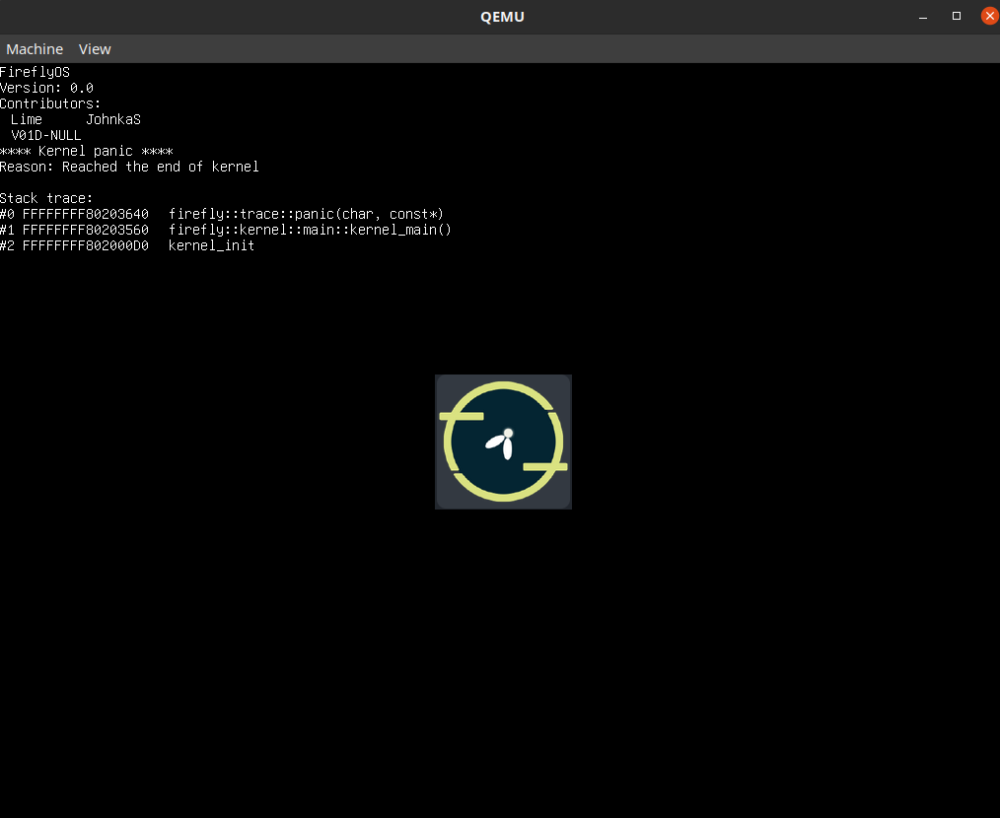

# Firefly-Kernel
Kernel for FireflyOS

## x64 demo:


## Dependencies ##
 * NASM
 * xorriso
 * qemu
 * mtools
 * clang++

## Clone the repo ##
 * git clone https://github.com/FireflyOS/Firefly-Kernel --recursive
 * cd Firefly-Kernel

## Ubuntu ##

```bash
sudo apt install nasm xorriso qemu-system-x86 mtools clang grub
```

```bash
# ARCH can be changed accordingly to fit the architecture you need.
# To see a list of available architectures run "make target_archs"
# without the double qoutes ("")
make ARCH=x86_64
make run ARCH=x86_64
```

You can run this on WSL by forwarding your xserver
Follow this: https://stackoverflow.com/questions/61110603/how-to-set-up-working-x11-forwarding-on-wsl2
